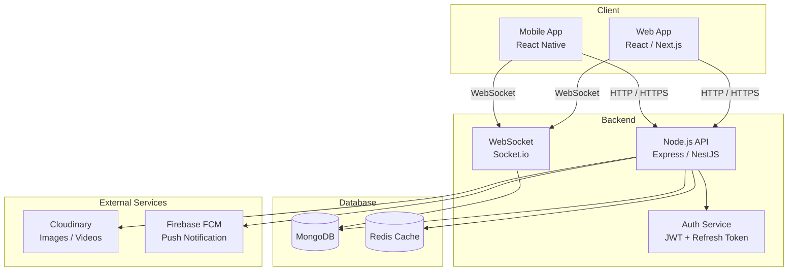
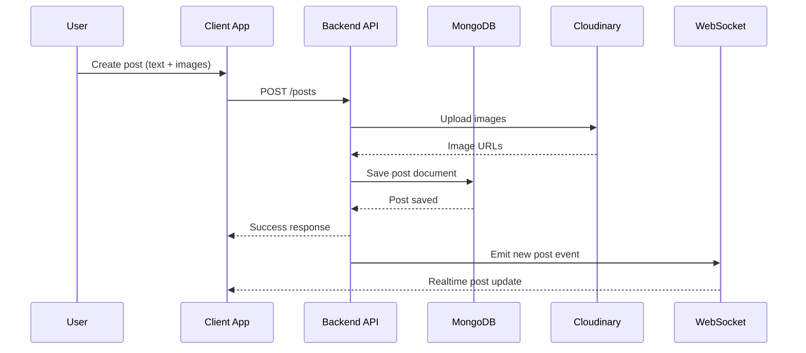
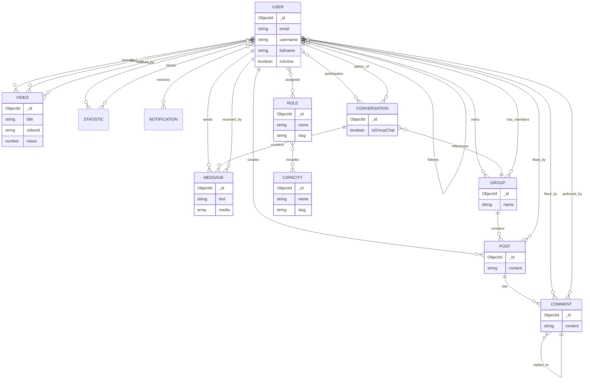

# Architecture Documentation – v-social-media

This document describes the **database architecture and schema design** of the **v-social-media** project using **MongoDB + Mongoose**.

---

## 📌 Overview

`v-social-media` is a social media platform that supports:

- User authentication & profile management
- Posts, likes, comments
- Follow / unfollow relationships
- Video uploads & statistics
- Roles & permissions
- Notifications
- Social account tracking
- System settings & priorities

The database is designed using **MongoDB collections** with **Mongoose schemas**, emphasizing flexibility and scalability.

---

## 🧱 Technology Stack

- **Database**: MongoDB
- **ODM**: Mongoose
- **Architecture style**: Document-based with references
- **ID type**: ObjectId
- **Relationships**: One-to-many & many-to-many via references

---

## 🗂 Collections Overview

| Collection | Purpose |
|-----------|--------|
| `users` | User accounts & profiles |
| `roles` | Role-based access control |
| `posts` | User-generated content |
| `videos` | Video content |
| `statistics` | View & visit tracking |
| `notifications` | User notifications |
| `socials` | Social media metadata |
| `settings` | System configuration |

---
## System Architecture

---

## Detailed Flow Diagram

--- 
## 🧩 Database Schema (ER Diagram)



---

## Schema Details

### 🧑 User Schema
- Purpose: Stores user credentials, profile information, social relationships, and access roles.
- Key Features:
    + Unique email and username
    + Followers / Following relationship
    + Role-based access control
    + Account activation flag

```js
const UserSchema = new Schema({
	email: {
		type: String,
		required: true,
		unique: true
	},
	fullname: {
		type: String,
		trim: true,
		required: true,
		maxLength: 25
	},
	username: {
		type: String,
		required: true,
		unique: true,
		trim: true,
		maxLength: 25
	},
	password: { type: String, required: true },
	avatar: {
		type: String,
		default: "https://res.cloudinary.com/dobieta/image/upload/v11947123/v/em-ju-anh-10%.png"
	},
	mobile: { type: String },
	gender: { type: String },
	website: { type: String },
	address: { type: String },
	story: { type: String },
	followers: [{ type: Schema.Types.ObjectId, ref: "user" }],
	following: [{ type: Schema.Types.ObjectId, ref: "user" }],
	saved: [{ type: Schema.Types.ObjectId }],
	salt: { type: String },
	type: { type: String, default: "register" },
	rf_token: { type: String },
	roles: [{ type: Schema.Types.ObjectId, ref: "role" }],
	root: { type: String },
	isActive: {type: Boolean, default: true}
})
```

### 🎭 Role Schema
- Purpose: Defines system roles and permissions grouping.
- Design Notes:
    + Many-to-many relationship with users
    + Extendable via capacities

```js
const RoleSchema = new Schema({
    name: { type: String, required: [true, 'Please add name of role'], maxLenth: 200, },
    users: [{ type: Schema.Types.ObjectId, ref: 'user' }],
    slug: { type: String, required: [true, 'Please add slug name'], unique: true },
    capacities: [{ type: Schema.Types.ObjectId, ref: 'capacity' }],
    createdBy: {
        type: String,
        default: "system",
    },
    updatedBy: {
        type: String,
        default: "system"
    }
})
```

### 📝 Post Schema
- Purpose: User-generated posts (text + images).
- Relationships:
    + Belongs to a user
    + Liked by many users
    + Contains comments

```js
const PostSchema = new Schema({
	content: {
		type: String,
		required: true
	},
	images: {
		type: Array
	},
	comments: [{
		type: Schema.Types.ObjectId,
		ref: 'comment'
	}],
	likes: [{
		type: Schema.Types.ObjectId,
		ref: 'user'
	}],
	user: {
		type: Schema.Types.ObjectId,
		ref: 'user'
	}
})
```

### 🎥 Video Schema
- Purpose: Video content uploaded by users.
- Key Fields:
    + videoId (unique)
    + views counter
    + Likes / dislikes tracking
    + Thumbnail & video URL

```js
const VideoSchema = new Schema({
    title: { type: String, required: true },
    user: { type: Schema.Types.ObjectId, ref: "user" },
    videoId: { type: String, required: true, unique: true },
    views: { type: Number, required: true, default: 0, min: 0 },
    duration: { type: Number, required: true },
    thumbnailUrl: { type: String, required: true },
    likes: [],
    dislikes: [],
    videoUrl: { type: String, required: true }
})
```

### 📊 Statistic Schema
- Purpose: Tracks traffic, views, and analytics per user.
- Usage:
    + Daily or session-based logging
    + Client-user relationships

```js
const StatisticSchema = new Schema({
    viewCount: { type: Number, default: 0 },
    visitCount: { type: Number, default: 0 },
    loggedAt: {
        type: Date,
        default: new Date(),
    },
    user: { type: Schema.Types.ObjectId, ref: "user" },
    clients: [{ type: Schema.Types.ObjectId, ref: "user" }]
})
```

### 🔔 Notification Schema
- Purpose: Stores system & user-generated notifications.
- Features:
    + Multi-recipient support
    + Read/unread state
    + Rich content (image, URL)

```js
const notifySchema = new Schema({
    user: { type: Schema.Types.ObjectId, ref: "user" },
    id: Schema.Types.ObjectId,
    text: String,
    url: String,
    content: String,
    image: String,
    recipients: [Schema.Types.ObjectId],
    isRead: { type: Boolean, default: false }
})
```

### 🌐 Social Schema
- Purpose: Stores third-party social account metadata.
- Notes:
    + Flexible object structure
    + No versioning (versionKey: false)

```js
const socialSchema = new Schema({
    github: Object,
    youtube: Object,
    facebook: Object,
    loggedAt: { type: String, required: true }
}, { versionKey: false });
```

## ⚙️ Setting Schema
- Purpose: System-wide configurations.
- Examples:
    + Priority handling mode
    + Secret keys

```js
const settingSchema = new Schema({
    priority_mode: {
        type: String,
        enum: ['right-away-continue', 'right-away-skip'],
        required: true
    },
    secret_key: {
        type: String,
        required: false
    }
})
```

## 🗨 Messaging & Conversation Architecture

- Chat system supports:
    + 1-on-1 conversation
    + Group chat
    + Send text/media/call
    + Group & admin management

## 💬 Conversation Schema
- Purpose: Represents a conversation (private or group).
- Key Fields:
    + recipients: list of participating users
    + isGroupChat: distinguishes between private and group chats
    + group: links to the group if it's a group chat
    + groupAdmin: user who manages the group chat

```js
const ConversationSchema = new Schema({
    recipients: [{ type: Schema.Types.ObjectId, ref: 'user' }],
    text: String,
    media: Array,
    call: Object,
    isGroupChat: { type: Boolean, default: false },
    groupAdmin: { type: Schema.Types.ObjectId, ref: "user" },
    group: { type: Schema.Types.ObjectId, ref: "group" }
})
```

## ✉️ Message Schema
- Purpose: Saves detailed messages within a conversation.
- Design Notes:
    + Each message belongs to a conversation
    + There are senders and recipients
    + Supports media & call objects

```js
const messageSchema = new Schema({
    conversation: { type: Schema.Types.ObjectId, ref: 'conversation' },
    sender: { type: Schema.Types.ObjectId, ref: 'user' },
    recipient: { type: Schema.Types.ObjectId, ref: 'user' },
    text: String,
    media: Array,
    call: Object
})
```

## 👥 Group Schema

- Purpose: Manage user communities/groups.
- Features:
    + Owner (user creates group)
    + Members
    + Posts in the group
    + Invite / public link
    + Extended Metadata

```js
const groupSchema = new Schema({
    user: { type: Schema.Types.ObjectId, ref: 'user' },
    name: { type: String, unique: true, maxLength: 200, required: true },
    members: [{ type: Schema.Types.ObjectId, ref: 'user' }],
    posts: [{ type: Schema.Types.ObjectId, ref: 'post' }],
    coverImage: String,
    additionalInfo: { type: String, required: true },
    inviteLink: { type: String },
    publicLink: { type: String, required: false },
    description: { type: String }
})
```

## 💭 Comment Schema

- Purpose: Save comments for posts, support reply & like.
- Design Highlights:
    + Nested comments via reply
    + Likes by multiple users
    + Trace posts & post owners

```js
const commentSchema = new mongoose.Schema({
    content: { type: String, required: true },
    likes: [{ type: mongoose.Types.ObjectId, ref: 'user' }],
    tag: Object,
    reply: mongoose.Types.ObjectId,
    user: { type: mongoose.Types.ObjectId, ref: 'user' },
    postId: mongoose.Types.ObjectId,
    postUserId: mongoose.Types.ObjectId
})
```

## 🧠 Capacity Schema
- Purpose: Defines capabilities/permissions for Roles.
- Usage:
    + Assign to Roles
    + Used to control detailed permissions

```js
const CapacitySchema = new Schema({
    name: { type: String, required: true, unique: true, maxLength: 25, trim: true },
    slug: { type: String, required: [true, "Điền thông tin có tâm đi bạn êi!"], unique: true }
})
```

## ⚙️ Setting Schema
- Purpose
    + System-wide configurations.
- Examples
    + Priority handling mode
    + Secret keys

## 🔗 Relationship Patterns
| Pattern                | Implementation         |
| ---------------------- | ---------------------- |
| User ↔ User (follow)   | Array of ObjectId      |
| User ↔ Role            | Many-to-many           |
| User → Post            | Reference              |
| User → Video           | Reference              |
| Post → Likes           | Array of User ObjectId |
| User ↔ Conversation    | Many-to-many           |
| Conversation → Message | One-to-many            |
| User → Message         | One-to-many            |
| Group → User           | Many-to-many           |
| Group → Post           | One-to-many            |
| Post → Comment         | One-to-many            |
| Comment → Comment      | Self-reference (reply) |
| Role → Capacity        | Many-to-many           |


## 🚀 Scalability Considerations

- Use indexes on:
    + email
    + username
    + videoId
- Avoid deep population chains
- Paginate followers / posts / videos
- Consider separating analytics into time-based collections if large scale

## 🛡 Security Notes
- Passwords must be hashed (bcrypt)
- Tokens stored separately (rf_token)
- Avoid exposing ObjectIds publicly
- Role & root fields for admin control

## 📎 Related Documentation
- docs/databases/index-management-guide.md
- docs/databases/query-inventory.md
- docs/databases/index-monitoring-queries.md

## ✅ Summary
- This architecture provides:
- Flexible schema design
- Clear relationship boundaries
- Scalable social interactions
- Extendable role & permission system
- Suitable for medium → large scale social media platforms built on MongoDB.