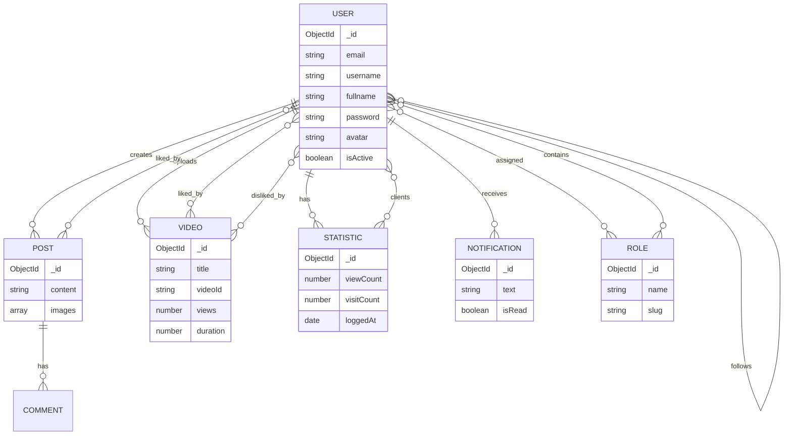

# Architecture Documentation – v-social-media

This document describes the **database architecture and schema design** of the **v-social-media** project using **MongoDB + Mongoose**.

---

## 📌 Overview

`v-social-media` is a social media platform that supports:

- User authentication & profile management
- Posts, likes, comments
- Follow / unfollow relationships
- Video uploads & statistics
- Roles & permissions
- Notifications
- Social account tracking
- System settings & priorities

The database is designed using **MongoDB collections** with **Mongoose schemas**, emphasizing flexibility and scalability.

---

## 🧱 Technology Stack

- **Database**: MongoDB
- **ODM**: Mongoose
- **Architecture style**: Document-based with references
- **ID type**: ObjectId
- **Relationships**: One-to-many & many-to-many via references

---

## 🗂 Collections Overview

| Collection | - Purpose |
|-----------|--------|
| `users` | User accounts & profiles |
| `roles` | Role-based access control |
| `posts` | User-generated content |
| `videos` | Video content |
| `statistics` | View & visit tracking |
| `notifications` | User notifications |
| `socials` | Social media metadata |
| `settings` | System configuration |

---

## 🧩 Database Schema (ER Diagram)



🧑 User Schema
- Purpose
    + Stores user credentials, profile information, social relationships, and access roles.
- Key Features
    + Unique email and username
    + Followers / Following relationship
    + Role-based access control
    + Account activation flag

```js
    followers: [{ ObjectId → user }]
    following: [{ ObjectId → user }]
    roles: [{ ObjectId → role }]
```
## 🎭 Role Schema
- Purpose
    + Defines system roles and permissions grouping.
- Design Notes
    + Many-to-many relationship with users
    + Extendable via capacities

## 📝 Post Schema
- Purpose
    + User-generated posts (text + images).
    + Relationships
    + Belongs to a user
    + Liked by many users
    + Contains comments

## 🎥 Video Schema
- Purpose
    + Video content uploaded by users.
- Key Fields
    + videoId (unique)
    + views counter
    + Likes / dislikes tracking
    + Thumbnail & video URL

## 📊 Statistic Schema
- Purpose
    + Tracks traffic, views, and analytics per user.
- Usage
    + Daily or session-based logging
    + Client-user relationships

## 🔔 Notification Schema
- Purpose
    + Stores system & user-generated notifications.
- Features
    + Multi-recipient support
    + Read/unread state
    + Rich content (image, URL)

## 🌐 Social Schema
- Purpose
    + Stores third-party social account metadata.

- Notes
    + Flexible object structure
    + No versioning (versionKey: false)

## ⚙️ Setting Schema
- Purpose
    + System-wide configurations.
- Examples
    + Priority handling mode
    + Secret keys

## 🔗 Relationship Patterns
| Pattern              | Implementation         |
| -------------------- | ---------------------- |
| User ↔ User (follow) | Array of ObjectId      |
| User ↔ Role          | Many-to-many           |
| User → Post          | Reference              |
| User → Video         | Reference              |
| Post → Likes         | Array of User ObjectId |


## 🚀 Scalability Considerations

- Use indexes on:
    + email
    + username
    + videoId
- Avoid deep population chains
- Paginate followers / posts / videos
- Consider separating analytics into time-based collections if large scale

🛡 Security Notes
- Passwords must be hashed (bcrypt)
- Tokens stored separately (rf_token)
- Avoid exposing ObjectIds publicly
- Role & root fields for admin control

📎 Related Documentation
- docs/databases/index-management-guide.md
- docs/databases/query-inventory.md
- docs/databases/index-monitoring-queries.md

## ✅ Summary
- This architecture provides:
- Flexible schema design
- Clear relationship boundaries
- Scalable social interactions
- Extendable role & permission system
- Suitable for medium → large scale social media platforms built on MongoDB.