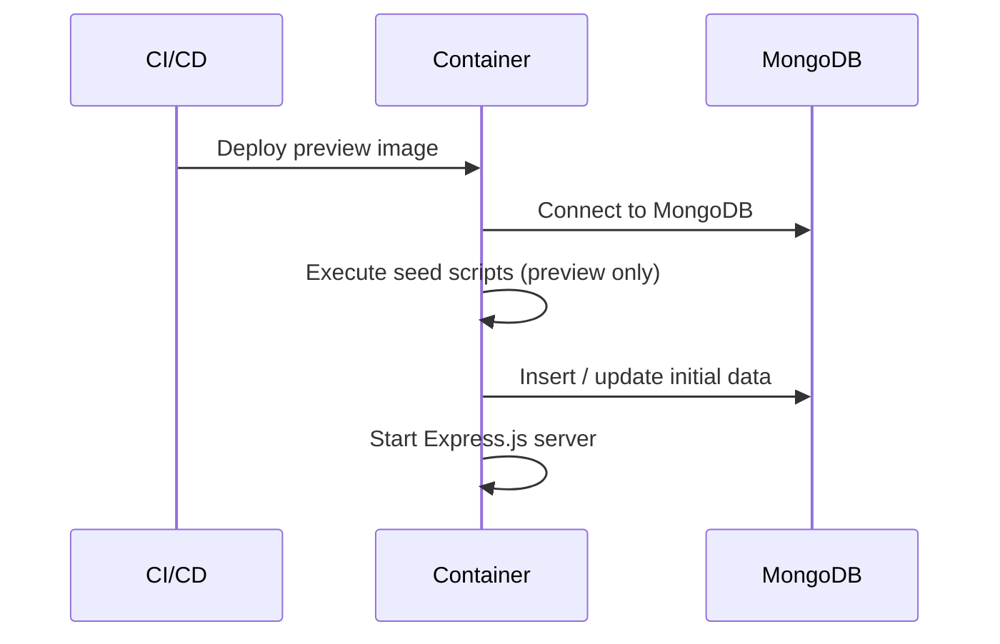

# Preview Environment Setup — v-social-media

This document describes how the **preview environment** for the `v-social-media` project is set up and how **MongoDB seed scripts** are executed automatically during deployment.

---

## 📌 Overview

When deploying to the **preview environment**, the deployment pipeline will automatically:

1. Prepare database connection to MongoDB
2. Run MongoDB seed scripts using Mongoose
3. Initialize default system data (roles, capacities, admin user, demo data)
4. Start the Node.js application normally

This ensures every preview deployment has **consistent and usable test data**.

---

## ⚙️ Implementation Details

### GitHub Actions – Deploy Step

During deployment to preview, the pipeline:

- Detects preview environment via:
  - `NODE_ENV=preview`
  - or `APP_ENV=preview`
- Runs a **seed step before starting the server**
- Uses the same Docker image as the API (no separate migration image)

Example logic:

- If `NODE_ENV === 'preview'`
  - Run seed scripts
  - Skip in production/staging

---

## 🌱 Database Seeding Strategy (MongoDB)

Because MongoDB does **not use migrations** like SQL databases, the project uses **idempotent seed scripts**.

### Seed Responsibilities

The seed process initializes:

- Default **roles** (admin, user, moderator)
- Default **capacities / permissions**
- System users (admin / demo)
- Sample posts, comments, groups (optional)
- System-level configuration data

---

## 🧩 Seed Entry Point

The main entry file for all seed scripts:

```ts
src/seeds/index.ts
```

This file orchestrates the entire seed lifecycle, including database connection, execution of individual seed tasks, and graceful shutdown.

---

## 🔁 Seed Execution Flow

High-level pseudo-flow executed by `src/seeds/index.ts`:

```text
connectMongoDB()
runRoleSeed()
runCapacitySeed()
runAdminUserSeed()
runDemoDataSeed()
disconnectMongoDB()
```

All seed steps are **safe to run multiple times** and will not create duplicate data.

---

## 🐳 Docker & Application Startup Flow

### Preview Environment Startup Sequence



Seed scripts always run **before** the API starts serving requests in preview.

---

## 📦 package.json Scripts

Example scripts configuration:

```json
{
  "scripts": {
    "start": "node dist/server.js",
    "start:preview": "node dist/seeds && node dist/server.js",
    "seed": "ts-node src/seeds/index.ts"
  }
}
```

| Script | Description |
|------|------------|
| `seed` | Run all seed scripts manually |
| `start:preview` | Preview startup with seeding |
| `start` | Normal production/staging startup |

---

## 🧪 Local Preview Testing

### Using Node.js

```bash
NODE_ENV=preview npm run seed
NODE_ENV=preview npm run start
```

### Using Docker

```bash
docker run \
  -e NODE_ENV=preview \
  v-social-media-api
```

---

## 🔐 Environment Variables

Required environment variables for preview:

| Variable | Description |
|--------|------------|
| `NODE_ENV` | Must be `preview` |
| `MONGO_URI` | MongoDB connection string |
| `JWT_SECRET` | JWT signing secret |
| `REFRESH_TOKEN_SECRET` | Refresh token secret |
| `CLOUDINARY_URL` | Media storage |
| `REDIS_URL` | Cache / socket presence (optional) |

---

## 🧠 Design Notes

- MongoDB seeding replaces traditional SQL migrations
- All seed scripts are **idempotent**
- Uses `findOneAndUpdate({ upsert: true })`
- No destructive operations in preview
- Production **never** runs seed automatically
- Preview data is safe to reset or discard

---

## ⚠️ Important Notes

- Preview environments may be recreated frequently
- Do **NOT** rely on preview data for persistence
- Seed scripts must:
  - Avoid duplicate users, posts, groups
  - Be safe for multiple executions
- Errors during seeding:
  - Are logged clearly
  - Fail deployment if **critical data** is missing

---

## 🚀 Future Improvements

- Split seed levels:
  - `seed:core`
  - `seed:demo`
- Add Faker-based content generator
- Add preview reset command
- Add preview database TTL cleanup

---

## ✅ Summary

The preview environment ensures:

- Fast, repeatable deployments
- Always-available test data
- Zero risk to production data

This setup significantly improves developer experience and QA workflows.
